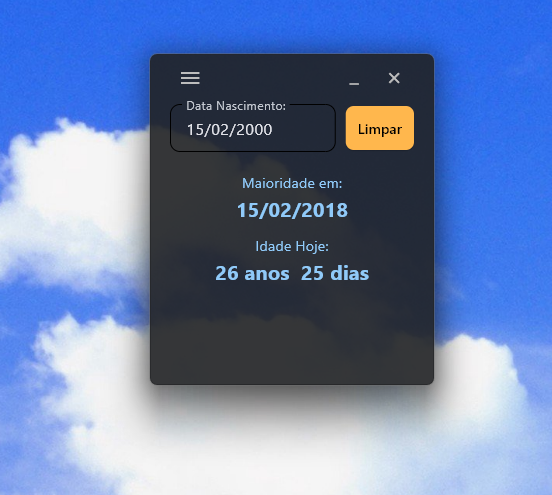
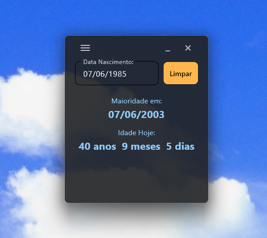

# Maioridade Calc

 

Um widget de desktop minimalista para calcular idade e data de maioridade a partir de uma data de nascimento.

> 📍 Repositório: [github.com/issaojr/maioridade-calc](https://github.com/issaojr/maioridade-calc)

## Funcionalidades

- Calcula a **idade atual** em anos, meses e dias
- Exibe a **data de maioridade** (18 anos)
- Aceita datas futuras — mostra a maioridade prevista e indica que a pessoa ainda não nasceu
- Auto-formatação do campo de data: basta digitar `15122000` ou `15/12/2000`
- Botão dinâmico **Ok / Limpar**
- Janela sempre no topo, sem barra de título nativa, arrastável

## Screenshots

<p align="center">
  
  &nbsp;&nbsp;
  
  &nbsp;&nbsp;
  
</p>

## Requisitos (para rodar a partir do código-fonte)

- Python 3.12+
- Flet 0.82.2

```bash
# Criar e ativar o ambiente virtual
python -m venv .venv
.venv\Scripts\activate      # Windows
source .venv/bin/activate   # Linux / macOS

# Instalar dependências
pip install -r requirements.txt

# Executar
python main.py
```

## Estrutura do projeto

```
age-calculator/
├── main.py             # Interface principal (Flet)
├── dialog_window.py    # Janelas filhas independentes (Sobre, Licença)
├── dialogs.py          # Lançador das janelas filhas via subprocess
├── logic.py            # Lógica de cálculo de idade e maioridade
├── constants.py        # Metadados do app (versão, autor, licença)
├── make_icon.py        # Converte assets/icon.png → assets/icon.ico
├── build.py            # Gera o executável de distribuição
├── assets/
│   └── icon.png          # ← coloque aqui (1024x1024, PNG com fundo transparente)
├── requirements.txt    # Dependências (flet, Pillow)
└── README.md
```

## Gerar executável para distribuição

Requer o ambiente virtual ativado com Flet instalado.

**1. Coloque o ícone em `assets/icon.png`** (1024×1024 px, PNG)

**2. Converta para `.ico`:**
```bash
python make_icon.py
```

**3. Gere o executável:**
```bash
# Arquivo único
python build.py

# Pasta (mais compatível com ambientes corporativos)
python build.py --onedir
```

O `build.py` chama `make_icon.py` automaticamente se `icon.ico` ainda não existir.
O executável será gerado em `dist/`.

## Licença

MIT © 2026 [Issao Hanaoka Junior](mailto:issaojr.dev@gmail.com) — veja o arquivo [LICENSE](LICENSE) para detalhes.
